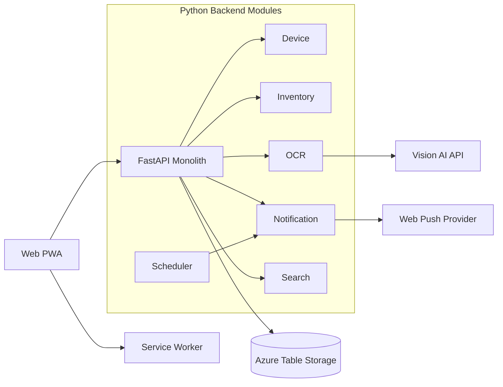

# 냉장고 알리미 아키텍처 (MVP 즉시 구현 버전)

## 1. 목표
- 목적: 지금 바로 MVP를 구현할 수 있는 최소 아키텍처를 정의한다.
- 본 문서는 PRD의 MVP 기술 구현 기준 문서다.
- 범위: 비로그인 개인/단일 기기, OCR 등록/수정, D-3 푸시 1회, 검색, 소진/폐기.

## 2. 선택 아키텍처
- 방식: 모듈러 모놀리식
- 기술: Python FastAPI + Next.js PWA
- 저장소: Azure Storage Account (Table)

## 3. 최소 기술 스택
- Frontend: Next.js (PWA, Service Worker, Web Push)
- Backend: FastAPI
- Data: Azure Table Storage
- Scheduler: APScheduler (API 단일 프로세스 내부 실행)
- OCR: 외부 Vision API (원본 이미지 미저장)

## 4. 시스템 구조

## 5. 모듈 책임 (MVP 필수만)
- Device
  - device_id 발급/유지, 기기 단위 데이터 스코프 강제
- Inventory
  - 등록, 수정, 수량 차감, 소진/폐기, 상태 계산
- OCR
  - 식재료명/유통기한 추출, 저장 전 사용자 확인/수정
- Notification
  - D-3 대상 조회, 1회 푸시 발송, 발송 로그 저장
- Search
  - 품목명 기반 보유 여부/수량 조회
- Scheduler
  - API 프로세스 내부 APScheduler로 일 1회 D-3 알림 작업 트리거

## 6. 데이터 모델 (MVP 최소)
- DeviceTable
  - PartitionKey: device_id
  - RowKey: profile
  - fields: push_permission_state, created_at, last_active_at
- InventoryItemTable
  - PartitionKey: device_id
  - RowKey: item_id
  - fields: item_name, storage_type, unit, volume, total_qty, status, updated_at
- InventoryBatchTable
  - PartitionKey: item_id
  - RowKey: batch_id
  - fields: expiry_date, qty, alert_basis_date, status
- NotificationLogTable
  - PartitionKey: device_id
  - RowKey: batch_id_notify_type
  - fields: sent_at, delivery_status

## 7. 핵심 정책 반영
- 비로그인
  - 모든 데이터는 device_id 기준으로 격리
- 데이터 정책
  - 이미지 원본 저장 금지, OCR 결과 텍스트만 저장
- 중복 규칙
  - 식재료명 + 보관구분 + 단위 + 용량 일치 시 수량 증가
  - 단위/용량 누락 시 신규 저장 (MVP에서는 병합 UX 제외)
- 알림 정책
  - 유통기한 D-3 푸시 1회
  - 동일 품목 다중 배치는 가장 이른 유통기한 기준
  - 푸시 권한 미허용 시 앱 내 배너/모달 안내

## 8. 배포 구조 (MVP 최소)
- web 컨테이너 1개 (Next.js)
- api 컨테이너 1개 (FastAPI)
- Azure Storage Account 1개 (Table)

## 9. MVP 제외 항목
- Outbox/Event Module
- InventoryEventTable 기반 이벤트 원장 저장
- Blob 기반 운영 리포트 저장
- 마이크로서비스 분리 설계
- Queue Worker 분리 배포
- 고급 큐 정책(우선순위 큐, 복잡한 재시도 체계)
- OCR 신뢰도 기반 자동 분기
- 단위/용량 누락 건 병합 선택 UX

## 10. MVP 구현 완료 기준
- 등록 -> 저장 -> 검색 -> 소진/폐기 -> D-3 알림 흐름이 end-to-end 동작
- 자동 인식 실패 시 수동입력으로 등록 완료 가능
- 알림 중복 발송이 없어야 함
- 핵심 KPI 이벤트(등록 성공률, 알림 후 재방문율, 소진율, 폐기율) 수집 가능
